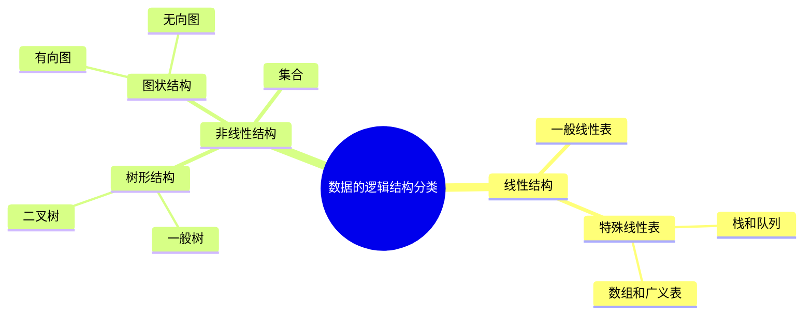

$$\boldsymbol{程序 = 数据结构 +算法}$$

## 1. 数据结构

### 1.1 数据结构的基本概念

#### 1.1.1 数据结构

+ 数据结构是相互之间存在一种或多种特定关系的**数据元素**的集合.

|  |  |  |
| - | - | - |
| 数据 |对客观事物的符号表示 | 图像, 声音等 |
| 数据元素 | 数据的基本单位, 学生的信息记录 |
| 数据项 | 构成数据元素的不可分割的**最小单位**, 一个数据元素可由若千个数据项组成 | 学号, 姓名, 性别等 |
| 数据对象 | 具有相同性质的数据元素的集合 |  |
| 数据结构 | 相互之间存在一种或多种特定关系的数据元素的集合, 逻辑结构, 存储结构和数据的运算 | $Data\_Structure = (D, S)$ |

#### 1.1.2 数据结构研究的问题

+ 数据结构是一门研究**非数值计算**的程序设计问题中计算机的操作对象以及它们之间的关系和操作等的学科.

#### 1.1.3 形式定义数据结构

+ 数据结构的形式定义可描述为一个二元组$Data\_Structures = (D, S)$. 
+ 其中: $D$是数据元素的有限集(数据对象), $S$是$D$上关系的有限集(数据关系).
+ 设两个元素$x$和$y$, 则可以用$<x, y>$表示由$x$指向$y$, 用 $(x, y)$表示由$x$和$y$有特定关系.
+ 举例:
	- $D=\{a_{i}|a_{1},a_{2},a_{3},a_{4},a_{5}\}$
	- $S_{1}=\{<a_{1},a_{2}>,<a_{2},a_{3}>,<a_{3},a_{4}>,<a_{4},a_{5}>\}$, 可以得到形如$a_1\rightarrow a_2\rightarrow a_3\rightarrow a_4\rightarrow a_5$的数据结构
	- $S_{2}=\{(a_{1},a_{2}),(a_{2},a_{3}),(a_{3},a_{4}),(a_{4},a_{5})\}$, 可以得到形如$a_1-a_2-a_3-a_4-a_5$的数据结构

#### 1.1.4 抽象数据类型(ADT)

+ 抽象数据类型(ADT)是指一个数学模型以及定义在该模型上的一组操作, 描述了数据的逻辑结构和抽象运算, 可用三元组$(D, S, P)$表示, 从而构成一个完整的数据结构定义.
+ 其中: $D$是数据元素的有限集(数据对象), $S$是$D$上关系的有限集(数据关系), $P$是对$D$的基本操作集(基本类型操作).
+ 举例:
	- $D=\{a_{i}|a_{1},a_{2},a_{3},a_{4},a_{5}\}$
	- $S_{1}=\{<a_{1},a_{2}>,<a_{2},a_{3}>,<a_{3},a_{4}>,<a_{4},a_{5}>\}$
	- $P = pop()$即删除第i个元素并返回其元素值
	- 若$i = 3$, 可以使数据结构$a_1\rightarrow a_2\rightarrow a_3\rightarrow a_4\rightarrow a_5$变为$a_1\rightarrow a_2\longrightarrow a_4\rightarrow a_5$并返回$a_3$
+ 定义ADT
	- 格式不唯一，可采用如下格式:
```
ADT <ADT名>
	{
	数据对象:<数据对象的定义>
	结构关系:<结构关系的定义>
	基本操作:<基本操作的定义>
	}ADT <ADT名>
```


### 1.2 数据结构的三要素

#### 1.2.1 数据结构的三要素

+ 逻辑结构: 是对数据元素之间的逻辑关系.
+ 物理结构: 是数据结构在计算机中的表示和实现, 故又称"存储结构".
+ 数据的运算: 施加在数据上的运算包括运算的定义和实现. 运算的定义是针对逻辑结构的, 运算的实现是针对存储结构的.

#### 1.2.2 数据的逻辑结构



逻辑结构的四大分类: 根据数据元素之间关系的不同特性, 分为:
+ 集合
+ 线性结构
    + [[2. 顺序表|数组]]
    + [[3. 链表|链表]]
    + [[4. 栈和队列|栈和队列]]
+ 树状结构
    + [[5. 树和二叉树|树]]
+ 图状或网状结构

根据二元组判断逻辑结构的方法: 
	1. 对于一个已知的二元组, 按顺序列出元素之间的关系.
	2. 对照集合, 线性结构, 树状结构, 图状或网状结构, 判断二元组对应的数据结构.

#### 1.2.3 数据的存储结构

数据的存储结构又称为**物理结构**. 在物理结构表示数据结构中, 主要研究数据元素的储存和关系的储存.
别称为数据元素的映象和关系的映象.

对于任意一个关系, 可分为:
+ **顺序存储**
+ **链式存储**
+ 索引存储
+ 散列存储

|  | 优点 | 缺点 |
|:-:|:-:|:-:|
| 顺序存储 | 随机存取, 每个元素占用最少的存储空间 | 只能使用相邻的存储单元, 可能产生较多的外部碎片 |
| 链式存储 | 不会出现碎片现象, 充分利用所有存储单元 | 只能顺序存取, 因存储指针而占用额外的存储空间 |
| 索引存储 | 检索速度快 | 索引表占用较多存储空间, 增加和删除数据时修改索引表花费时间 |
| 散列存储 | 检索、增加、删除速度快 | 可能出现元素存储单元的冲突, 解决冲突会增加时间和空间开销 |


## 2. 算法

### 2.1 算法的概念

+ 算法是一系列解决问题的清晰指令, 是计算机处理信息的本质
+ 算法是独立存在的一种解决问题的方法和思想


算法是对特定问题求解步骤的一种描述:
1. 输入项: 算法具有0个或多个输入
2. 输出项: 算法至少有1个输出
3. 有穷性: 算法必须能在有限个步骤之后终止, 并且需要在可接受的时间内
4. 确定性: 算法的每一步骤必须有确切的定义
5. 可行性: 算法的每一步都是可行的


通常设计一个“好”的算法应考虑达到以下目标:
1. 正确性
2. 可读性
3. 健壮性
4. 效率与低存储量需求

### 2.2 算法分析

算法效率的度量是通过时间复杂度和空间复杂度来描述的

+ 频度
	+ 该语句在算法中被重复执行的次数
	+ 算法中所有语句的频度之和 $T(n)=O(f(n))$
+ 加法规则:
	+ $T(n)= T_1(n)+ T_2(n)= O(f(n))+ O(g(n))= O(max(f(n),g(n)))$
+ 乘法规则:
	+ $T(n)= T_1(n)\times T_2(n)= O(f(n))\times O(g(n))= O(f(n)\times g(n))$
+ 常见的渐近时间复杂度为:
	+ $O(1) < O(log_2n) < O(n) < O(nlog_2n) < O(n^2) < O(n^3) < O(2^n) < O(n!) < O(n^n)$

### 2.3 时间复杂度

**时间频度：** 一个算法中的语句执行次数称为语句频度或时间频度, 记为T(n)

**时间复杂度:** 全称渐进时间复杂度, 描述随着问题的数据规模的增长, 算法的时间频度的增长趋势. 记作O(F(n)), F(n)是T(n)的渐进函数.

#### 1. 计算

+ 计算时, 往往只关注时间频度中的最高次项,其他次要项和常数项忽略
+ 顺序结构,时间复杂度按加法来计算
+ 循环结构,时间复杂度按乘法来计算
+ 分支结构,时间复杂度取最大值
+ 没有特殊说明时, 算法的时间复杂度都是指最坏的时间复杂度

PS:
如果a+b+c=1000，且 a^2+b^2=c^2 (a,b,c为自然数），如何求出所有a、b、c可能的组合?

```python
for a in range(0, 1001):
	for b in range(0, 1001):
		for c in range(0, 1001):
			if a + b + c == 1000 and a**2 + b**2 == c**2:
				print([a, b, c])
```
时间频度: $T(n) = n*n*n*2$
时间复杂度: $O(n^3)$

```python
for a in range(0, 1001):
	for b in range(0, 1001 - a):
		c = 1000 - a -b
		if a**2 + b**2 == c**2:
			print([a, b, c])
```
时间频度: $T(n) = \frac{(n+1)n}{2}*3 = 1.5n^2 + 1.5n$
时间复杂度: $O(n^2)$

#### 2. 最坏时间复杂度

- 最优时间复杂度-算法完成工作最少需要多久
- 最坏时间复杂度-算法完成工作最多需要多久
- 平均时间复杂度-算法完成工作平均需要多久
- 均摊时间复杂度-平均时间复杂度的补充, 应用场景极少

PS:
用户输入长度为6的数组,数组由1-6六个数字组成,顺序随机请返回数宁6出现的位置
```python
# lst = [1，2，3，4，5，6]  最坏时间复杂度 O(n)
lst = [6，5，4，3，2，1]  # 最优时间复杂度 O(1)
# 平均时间复杂度 (1+2+3+4+5+6)/6 = 7/2 O(n)

for idx in range(6):
	if lst[idx] == 6:
		print(idx)
		break

```

#### 3. 常见时间复杂度与大小关系

|时间频度举例|阶|非正式术语|
|:-:|:-:|:-:|
|$12$|$O(1)$|常数阶|
|$2n+3$|$O(n)$|线性阶|
|$3n^2+ 2n + 1$|$O(n^2)$|平方阶|
|$5log_2n+20$|$O(logn)$|对数阶|
|$2n+3nlog_2n+19$|$O(nlogn)$|nlogn阶|
|$6n^3+2n^2+3n+4$|$O(n^3)$|立方阶|
|$2^n$|$O(2^n)$|指数阶|
注意，经常将log2n(以2为底的对数）简写成logn
$O(1) < O(logn) < O(n) < O(nlogn) < O(n^2) < O(n^3) < O(2^n) < O(n!) < O(n^n)$

### 3. timeit模块使用

[[../../../../../Piece/python/timeit模块(时间复杂度分析)]]