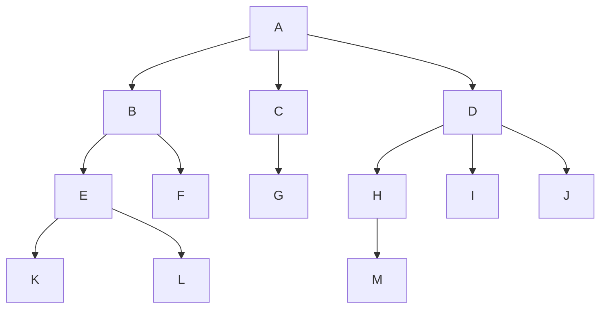
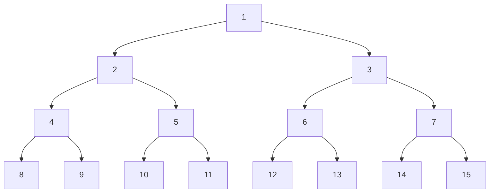
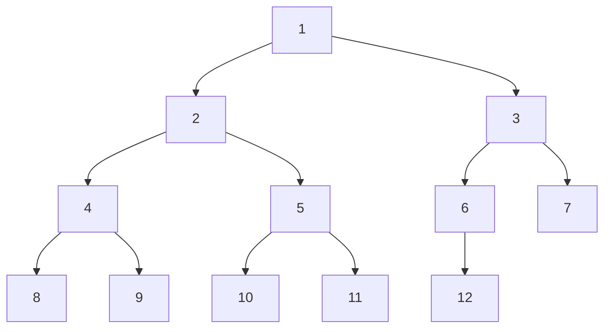
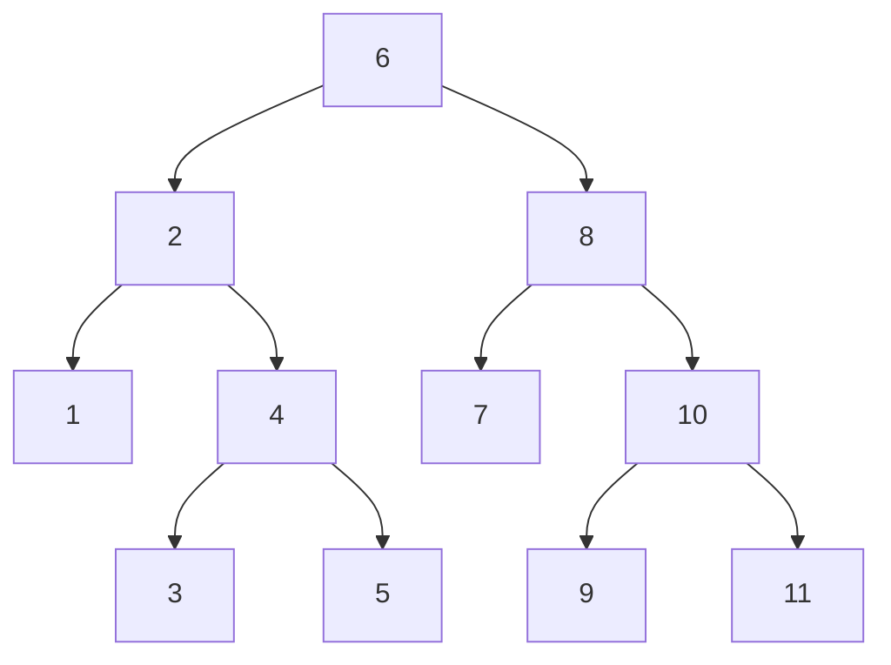
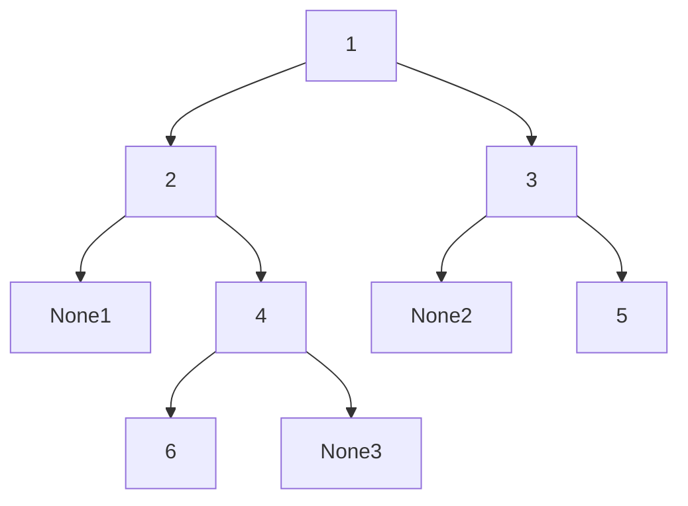

树, 二叉排序树, 哈夫曼树，哈夫曼编码，
## 1. 树 Tree

### 1.1 树的基本概念

+ 树: $n(n\geq0)$个结点的有限集 ($n = 0$时为空树)
+ **只可能有一个直接前驱，但可有多个直接后继**



#### 1.1.1 基本术语

1. 祖先, 双亲, 孩子
2. 度: 
    1. 结点的度: 该结点的孩子个数
    2. 树的度: 树中结点的最大度数
3. 结点: 
    1. 分支结点(非终端结点): 度大于0
    2. 叶子结点(终端结点): 度为0
    3. 兄弟结点: 有相同双亲的结点
4. 深度, 高度: 
    1. 深度: 自顶向下的层数
    2. 高度: 自底向上的层数
5. 有序树, 无序树:
    1. 有序树: 子节点无法交换顺序
    2. 无序树: 子节点交换顺序后为同一树
6. 路径: 
    1. 路径: 两个结点之间所经过的结点序列
    2. 路径长度: 路径经过的边的条数

#### 1.1.2 树的性质

1. 树中的结点数等于所有结点的度数加$1$ ^984963
2. 度为$m$的树中第$i$层上至多有$m^i-1$个结点 ^96d8b9

| | |
|-|-|
|1|1|
|2|$m$|
|3|$m^2$|
3. 高度为$h$的$m$叉树至多有$\frac{m^h-1}{m-1}$个结点 ^686227

$$1+m+m^2+...+m^{h-1} = \frac{m^h-1}{m-1}$$
4. 具有$n$个结点的$m$叉树的最小高度为$\log_m(n(m-1)+1)$

## 2. 二叉树 BiTree

### 2.1 二叉树的基本概念


二叉树是$n(n\geq0)$个结点的有限集合:
+ 或者为空二叉树
+ 或者由一个根结点和两个互不相交的被称为根的左子树和右子树组成, 左右子树又分别是一棵二叉树

#### 2.1.1 特殊二叉树

##### 满二叉树

高度为$h$的二叉树有$2^h-1$个结点



##### 完全二叉树

满二叉树从右往左减去结点



##### [[#2.4.5 二叉排序树|二叉排序树(二叉查找树)]]


对于二叉排序树与其子树: 左子树上任意结点 < 根结点 < 右子树上任意结点  



##### 平衡二叉树

树上任一结点的左子树和右子树的深度之差绝对值不超过1

### 2.2 二叉树的性质

1. 非空二叉树上的叶子结点数等于度为$2$的结点数加$1$，即$n_0 = n_2+1$ ![[5. 树和二叉树#^984963]]$$n = n_0 + n_1 + n_2 \quad n = 0 \times n_0 + 1 \times n_1 + 2 \times n_2 + 1$$
2. 非空二叉树上第$k$层上至多有$2^k-1$个结点![[5. 树和二叉树#^96d8b9]]
3. 高度为$h$的二叉树有$2^h-1$个结点![[5. 树和二叉树#^686227]]
4. 完全二叉树中$i$的双亲结点为$\begin{cases}\lfloor\frac{i}{2}\rfloor\quad i为偶数\\\lfloor\frac{i-1}{2}\rfloor\quad i为奇数\end{cases}$
5. 具有$n(n>0)$个结点的完全二叉树的高度为$\lceil\log_{2}{(n +1)}\rceil$或$\lfloor\log_2n\rfloor+1$
$$
\begin{aligned}
2^{h-1}-1<n\leq2^h-1 & \quad & 2^{h-1} \leq n < 2^h \\
h-1<(\log_2{(n+1)}\leq h) & \quad & (h-1 \leq \log_2{n}) < h
\end{aligned}
$$

### 2.3 二叉树的存储结构

1. 顺序存储结构
    指用一组地址连续的存储单元依次自上而下, 自左至右存储完全二叉树的结点元素, 即将完全二叉树上编号为$i$的结点元素存储在一维数组下标$i-1$的分量中
2. 链式存储结构: 用链表结点来存储二叉树中的每个结点
```python
class BiTreeNode:
    def __init__(self, val):
        self.val = val
        self.lchild = None
        self.rchild = None
```
在含有$n$个结点的二叉链表中, 含有$n + 1$个空链域，含有$n - 1$个非空链域

### 2.4 二叉树的遍历

按某条搜索路径访问树中每个结点, 使得每个结点均被访问一次, 而且仅被访问一次

按照先遍历左子树再遍历右子树的原则, 常见的遍历次序有先序 (NLR), 中序(LNR)和后序(LRN)三种遍历算法



^e6dc5f

#### 2.4.1 先序遍历 NLR

若二叉树为空, 则什么也不做; 否则, 
1. 访问根结点
2. 先序遍历左子树
3. 先序遍历右子树

性质: 对于树或其子树遍历结果, 头元素为根结点

![[5. 树和二叉树#^e6dc5f]]先序遍历所得到的结点序列为`[1, 2, 4, 6, 3, 5]`

#### 2.4.2 中序遍历 LNR

若二叉树为空, 则什么也不做; 否则, 
1. 先序遍历左子树
2. 访问根结点
3. 先序遍历右子树

性质: 对于树或其子树遍历结果, 中间元素为根结点
![[5. 树和二叉树#^e6dc5f]]中序遍历所得到的结点序列为`[2, 6, 4, 1, 3, 5]`

#### 2.4.3 后序遍历 NLR

若二叉树为空, 则什么也不做; 否则, 
1. 访问根结点
2. 先序遍历左子树
3. 先序遍历右子树

性质: 对于树或其子树遍历结果, 尾元素为根结点
![[5. 树和二叉树#^e6dc5f]]先序遍历所得到的结点序列为`[6, 4, 2, 5, 3, 1]`

#### 2.4.4 层序遍历


使用队列, 见下代码
![[5. 树和二叉树#^e6dc5f]]层序遍历所得到的结点序列为`[1, 2, 3, 4, 5, 6]`


```python
class BiTree:
    def order(self, way):
        trlist = []
        if self.root:
            # 前序遍历
            if way == 'pre':    
                def pre_order(root):
                    if root:
                        trlist.append(root.val)
                        pre_order(root.lchild)
                        pre_order(root.rchild)
                pre_order(self.root)
            # 中序遍历
            elif way == 'in':
                def in_order(root):
                    if root:
                        in_order(root.lchild)
                        trlist.append(root.val)
                        in_order(root.rchild)
                in_order(self.root)
            # 后序遍历
            elif way == 'post':
                def post_order(root):
                    if root:
                        post_order(root.lchild)
                        post_order(root.rchild)
                        trlist.append(root.val)
                post_order(self.root)
            # 层次遍历
            elif way == 'level':
                i = 0
                trnodelist = [self.root]
                while i < len(trnodelist):
                    if trnodelist[i].lchild:
                        trnodelist.append(trnodelist[i].lchild)
                    if trnodelist[i].rchild:
                        trnodelist.append(trnodelist[i].rchild)
                    i += 1
                for i in trnodelist:
                    trlist.append(i.val)
            else:
                pass
        return trlist
```


### 2.5 二叉排序树

二叉排序树(二叉查找树)或者是一颗空树, 或者是具有下列特性的二叉树

1. 若左子树非空, 则左子树上所有结点的值均小于根结点的值
2. 若右子树非空, 则右子树上所有结点的值均大于根结点的值
3. 左, 右子树也分别是一棵二叉排序树


##### 插入

+ 若原二叉排序树为空
    + 则直接插入根结点
+ 否则
    + 若关键字小于根结点值
        + 则插入到左子树
    + 若关键字大于根结点值
        + 则插入到右子树

```python
class SBTree:
    def __init__(self):
        self.root = None
    def insert(self, value):
        if type(value) is not BiTreeNode:
            value = BiTreeNode(value)
        if self.root is None:
            self.root = value
        else:
            root = self.root
            while root:
                if value.val < root.val:
                    if root.lchild:
                        root = root.lchild
                    else:
                        root.lchild = value
                        break
                elif value.val > root.val:
                    if root.rchild:
                        root = root.rchild
                    else:
                        root.rchild = value
                        break
                else:
                    break
```

##### 构造

从一棵空树出发, 依次输入元素, 将它们插入二叉排序树的合适位置

##### 删除

1. 若被删除的结点是叶子结点, 则直接删除
2. 若结点只有一棵左子树或者右子树, 则让该结点的子树成为其父结点的子树
3. 若结点有左, 右两棵子树, 则令该结点的直接后继 (直接前驱) 代替该结点然后从二叉排序树中删去这个直接后继 (直接前驱), 这样就转换成了前两种情况

```python
class SBTree:
    def DelVal(self, val):
        node = self.FindVal(val) # 按值寻找
        nodeFC = self.FindValFC(val) # 按值找爸
        if node is False:
            return False
        def delnode(node, nodeFC):
            Ln = node.lchild is None
            Rn = node.rchild is None
            if Ln and Rn:
                if nodeFC[1] == 'lchild':
                    nodeFC[0].lchild = None
                else:
                    nodeFC[0].rchild = None
                return True
            elif Ln and (not Rn):
                if nodeFC[1] == 'lchild':
                    nodeFC[0].lchild = node.rchild
                else:
                    nodeFC[0].rchild = node.rchild
                return True
            elif Rn and (not Ln):
                if nodeFC[1] == 'lchild':
                    nodeFC[0].lchild = node.lchild
                else:
                    nodeFC[0].rchild = node.lchild
                return True
            else:
                nodenextval = node.rchild.val
                node.rchild.val = val
                node.val = nodenextval
                nodeFC = [node, 'rchild']
                node = node.rchild
                return delnode(node, nodeFC)
        delnode(node, nodeFC)
```

### 2.6 哈夫曼树 (最优二叉树)
#### 2.6.1 哈夫曼树的基本概念

+ 权: 树中结点常被赋予一个代表某种意义的数值
+ 结点带权路径长度: 从树的根到任意结点的路径长度与该结点上权值的乘积
+ 树的带权路径长度: 树中**所有叶结点**的带权路径长度之和，记为$WPL = \sum_{i=1}^nw_il_i$;
+ 哈夫曼树: 带权路径长度最小的二叉树

#### 2.6.2 哈夫曼树的构造

1. 将所有结点分别作为仅含一个结点的二叉树
2. 构造一个新结点, 从中选取两棵根结点权值最小的树作为新结点的左, 右子树, 并且将新结点的权值置为左, 右子树上根结点的权值之和
3. 从中删除刚才选出的两棵树, 同时将新得到的树加入森林中
4. 重复步骤(2)和(3), 直至剩下一棵树为止

![[Pasted image 20231212000101.png]]


## 3. 树与森林

$$孩子在左, 兄弟在右$$
### 3.1 树转换成二叉树

1. 在兄弟结点之间加一条线
2. 对每个结点, 只保留它与第一个孩子的连线, 抹去与其他孩子的连线
3. 以树根为轴心, 顺时针旋转 45
![[Pasted image 20231213111610.png]]

### 3.2 森林转换成二叉树

1. 将森林中的每棵树转换成相应的二叉树
2. 每棵树的根也可视为兄弟结点, 在兄弟结点之间加一条线
3. 对每个结点, 只保留它与第一个孩子的连线, 抹去与其他孩子的连线
4. 以树根为轴心, 顺时针旋转 45
![[Pasted image 20231213111729.png]]