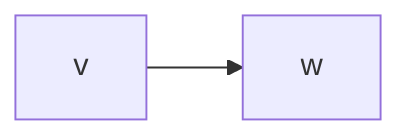
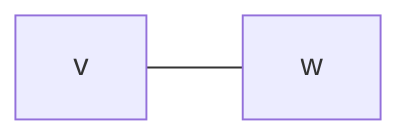
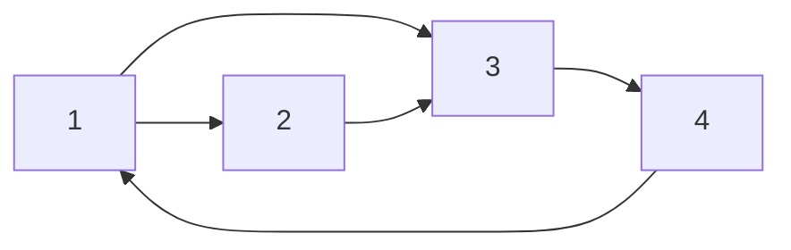
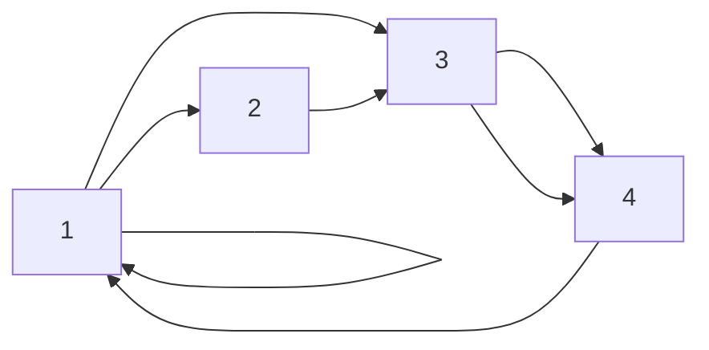
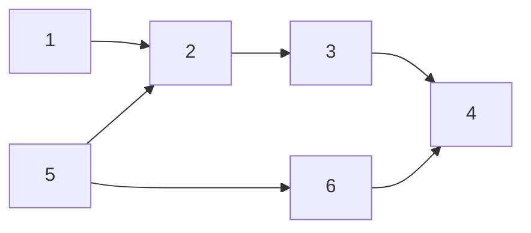

图，图的连通分量，深度优先搜索，广度优先搜索，最小生成树，拓扑排序，平衡二叉树，平衡因子，最短路径两种算法

## 1. 图的基本概念

1. 有向图: $<v, w>$

2. 无向图: $(v, w)$

3. 简单图: 
    1. 不存在重复边
    2. 不存在顶点到自身的边

4. 多重图:
    1. 或存在重复边
    2. 或存在顶点到自身的边

5. 完全图 (简单完全图)
    1. 无向完全图: 任意两个顶点之间都存在边, 共$\frac{n(n-1)}{2}$个边
    2. 有向完全图: 任意两个顶点之间都存在方向相反的两条弧, 共$n(n-1)$个
6. 子图, 生成子图:
    1. 子图的顶点集与边集为原图的子集
    2. 生成子图的边集为原图的子集, 顶点集与原图相同
7. 连通, 连通图:
    1. 连通: 在图中存在路径, 无向图为连通, 有向图为强连通
    2. 连通图: 图中任意两个顶点都是连通的
    3. 极小连通子图: 既要保持图连通又要使得边数最少的子图
8. 生成树: 包含图中全部顶点的一个极小连通子图 (生成子图 + 极小连通子图)[[#^ 4.1 最小生成树| 最小生成树]]
9. 度:
    1. 无向图: 无向图的顶点的度为其连接的边的个数, 无向图的全部顶点的度的和等于边数的两倍
    2. 有向图:
        1. 入度: 以顶点为终点的有向边的数目
        2. 出度: 以顶点为起点的有向边的数目
        3. 度: 等于入度和出度之和, 有向图的全部顶点的入度之和与出度之和相等，并且等于边数
10. 边的权和网: 边上的数值, 带权图又称为网
11. 路径, 路径长度, 回路:
    1. 路径长度: 路径上边的长度
    2. 起点与终点相同的路径, 称为回路或环
12. 连通分量:
    1. 无向图G的极大连通子图称为G的连通分量
        极大连通子图意思是: 该子图是 G 连通子图, 将G的任何不在该子图中的顶点加入, 子图不再连通
    2. 有向图G的极大强连通子图称为G的强连通分量
        极大强连通子图意思是: 该子图是G的强连通子图, 将D的任何不在该子图中的顶点加入, 子图不再是强连通的

## 2. 图的存储结构

图的存储结构有四种:
1. [[#^2.1 邻接矩阵法| 邻接矩阵法]]
2. [[#^2.2 邻接表法| 邻接表法]]
3. 十字链表法
4. 邻接多重表法

### 2.1 邻接矩阵法

##### 无向图

邻接矩阵为一个关于主对角线对称的方阵
$$
A[i][j]=
\begin{cases}
1, (\nu_i,\nu_j)\text{存在} \\
0, (\nu_i,\nu_j)\text{不存在}
\end{cases}
$$

![[Pasted image 20231212002646.png]]
$n$个顶点的无向连通图用邻接矩阵表示时, 该矩阵至少有$2(n- 1)$个非零元素
##### 有向图

邻接矩阵为不一定关于主对角线对称的方阵
$$
A[i][j]=
\begin{cases}
1, <\nu_i,\nu_j>\text{存在} \\
0, <\nu_i,\nu_j>\text{不存在}
\end{cases}
$$

![[Pasted image 20231212002657.png]]

##### 带权图

$$
A[i][j]=
\begin{cases}
w_{ij}, (\nu_i,\nu_j)\text{或}<\nu_i,\nu_j>\text{存在} \\
0, (\nu_i,\nu_j)\text{或}<\nu_i,\nu_j>\text{不存在}
\end{cases}
$$

![[Pasted image 20231212003152.png]]

### 2.2 邻接表法

##### 无向图

存储两次边, 一次节点$$O(|V| + 2|E|)$$
![[Pasted image 20231212003514.png]]
##### 有向图

存储一次边, 一次节点$$O(|V| + |E|)$$
![[Pasted image 20231212003705.png]]

1. 若G为无向图，则所需的存储空间为 O(IVI +2IEI)
    若G为有向图，则所需的存储空间为 O(IVIIEI)
2. 对于稀疏图, 采用邻接表表示能极大地节省存储空间
3. 图的邻接表表示不唯一
4. 在有向图的邻接表表示中, 求一个给定顶点的出度只需计算其邻接表中的结点个数

## 3. 图的遍历

+ 图的遍历: 从图中的某一顶点出发，按照某种搜索方法沿着图中的所有顶点访问一次且仅访问一次
+ 图的遍历算法主要有两种: [[#^3.1 广度优先搜索 BFS| 广度优先搜索]]和[[#^3.2 深度优先搜索| 深度优先搜索]]

### 3.1 广度优先搜索 BFS

### 3.2 深度优先搜索 DFS

## 4. 图的应用

### 4.1 最小生成树

带权连通无向图中, 所有生成树中权值之和最小的生成树

#### $Prim$算法

适于稠密网
1. 任取一顶点, 去掉所有边
2. 选择一个与当前顶点集合距离最近的顶点, 并将该顶点和相应的边加入进来, 同时不能形成回路
3. 重复(2), 直至图中所有顶点都并入
![[Pasted image 20231212004803.png]]

#### $Kruskal$算法

适于稀疏网
1. 去掉所有边
2. 选边 (权最小, 且不构成回路)
3. 重复(2), 直至图中所有顶点都并入

![[Pasted image 20231212005031.png]]

### 4.2 最短路径

#### $Dijkstra$算法

单源最短路径
![[Pasted image 20231212005524.png]]

#### $Floyd$算法

所有顶点间的最短路径

### 4.3 拓扑排序

+ AOV网: 顶点表示活动 $<V_i, V_j>$
+ 拓扑排序: 
    + 每个顶点出现且只出现一次
    + 若存在一条从顶点A到顶点B的路径, 则在排序中顶点B出现在顶点A的后面
+ 拓扑排序的算法的步骤:
    1. 从 AOV网中选择一个没有前驱的顶点并输出
    2. 从网中删除该顶点和所有以它为起点的有向边
    3. 重复(1)和(2)直到当前的AOV网为空或当前网中不存在无前驱的顶点为止

下图的**一个**拓序排序序列为: 152364

### 4.4 关键路径

+ AOE网: 以顶点表示事件, 以有向边表示活动, 以边上的权值表示完成该活动的开销
+ 关键路径: 从开始顶点到结束顶点的所有路径中, 具有**最大**路径长度的路径
+ 关键活动: 关键路径上的活动

